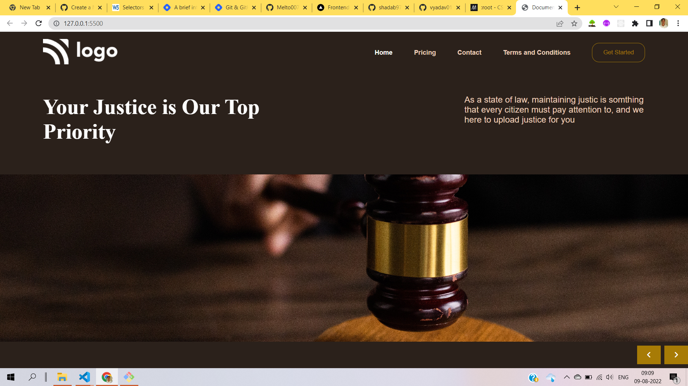

# Hi !!! I'm Aravind

In this project of creating static landing page for law site i learnt and used the below mentioned `tech stack`

- HTML5
  - i learnt how to make separate div tags to make the process of styling easier
- CSS3
  - used flexbox module to position the HTML5 elements
  - learnt about `:root` [pseudo class](https://developer.mozilla.org/en-US/docs/Web/CSS/:root) of css3 to apply styling to root `<html>` tag with higher specificity

> Here's the glimpse of project pic

